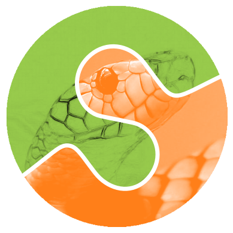

## Schedule {.smaller}

::: {.incremental}
* Aims
* Why learn Python?
* Basics
  + Variables
  + Data types
  + Loops
  + Conditional statements
  + List comprehensions
* How to work with Python? (using IDEs, environments, etc...)
* Writing your first Python script
* Loading and saving data
:::

## Schedule {.smaller}
::: {.incremental}
* Recap and Q&A
* Using third party libraries from pip and conda
* Functions and methods
* Classes and objects
* Errors and exceptions
* Organising your code
* Documenting your code
:::

## Aims
::: {.incremental}
* Introduce Python
* Introduce some basic programming concepts
* Show you *one* (our) way of doing things
  + Not necessarily the best or only way
* Give you the confidence to start doing it yourself
* Prepare you for other courses
:::

::: {.fragment}
Please ask any **questions at any time**!
:::

# Why learn Python?

## Why learn Python? {.smaller}
::: {.fragment}
Popularity

- Python is the most popular programming language for data science[$^1$](https://aimresearch.co/product/data-science-skills-study-2023/)
:::

::: {.fragment}
Free and open source

- Unlike MATLAB, IGOR, etc...
- Anyone can use your code
  + 9.7M open Python repositories[$^2$](As 2024-04-06, github.com/oprogramador/github-languages) on {width=1em} 
:::

::: {.fragment}
Versatile
Not just for data analysis / machine learning

- Visualisation
- Web development
- Data acquisition
:::

## Why learn Python? {.smaller}
Packages for everything!

::: {.fragment}
{width=2em style="margin-bottom: 0px; vertical-align: bottom;"} Numpy: arrays  
:::

::: {.fragment}
{width=2em style="margin-bottom: 0px; vertical-align: bottom;"} Pandas: dataframes  
:::

::: {.fragment}
{width=2em style="margin-bottom: 0px; vertical-align: bottom;"} SciPy: scientific computing  
:::

::: {.fragment}
{width=2em style="margin-bottom: 0px; vertical-align: bottom;"} Scikit-image: image analysis  
:::

::: {.fragment}
{width=2em style="margin-bottom: 0px; vertical-align: bottom;"} PyTorch: machine learning  
:::

::: {.fragment}
{width=2em style="margin-bottom: 0px; vertical-align: bottom;"} Matplotlib: plotting  
:::

::: {.fragment}
*People have spent lots of time optimising these packages! Don't reinvent the wheel!*

:::

# Interactive Python



# Basics of Python



# Writing your first Python script



# Loading and saving data



# Functions



# Classes and objects



# Errors and exceptions



# IDEs



# Virtual environments



# Modules and packages



# Organising your code



# Documenting your code



# Next steps
## Next steps {.smaller}

::: {.incremental}
* We've covered some of the basics
* Next steps -- Practice!:
  + Mess around with code
  + Solve problems
  + Google stuff
  + Contact
  + Additional courses
:::

## Further resources {.smaller}

::: {.incremental}
* [CS50](https://pll.harvard.edu/course/cs50-introduction-computer-science)
* UCL ARC courses
  + [An introduction to programming for research using Python](https://rits.github-pages.ucl.ac.uk/doctoral-programming-intro/)
  + [Research software engineering with Python](https://github-pages.ucl.ac.uk/rsd-engineeringcourse/)
  + [Software carpentry courses](https://software-carpentry.org/lessons/)
  + [Exercism](https://exercism.org/tracks/python)
:::

## Troubleshooting tips {.smaller}

::: {.incremental}
* Make sure the correct environment is activated
  + `which python` or `which pip` to check
* Check the scope of your variable
* Pay attention to whether an operation is `in_place` or not
  + Especially with `pandas` and `numpy`
* Structure your code as a package as soon as you can
  + `pyproject.toml` → more on this in future sessions!
* Look out for deep vs shallow copies
  + Especially with collections (lists, dicts, sets)
:::

## Question
::::: {.columns}
::: {.column .incremental width="55%"}
* What does this return?
:::

::: {.column width="45%"}
:::: {.fragment .fade-in}
```{python}
#| echo: true
#| output-location: fragment
a = [1, 2, 3]
b = a
b[0] = 42

print(a[0])
```
::::
:::
:::::


## Troubleshooting tips {.smaller}

::: {.incremental}
* Read the error messages!
  + Google is your friend
  + LLMs can help too
  + Ask a colleague or contact us
* Use a debugger (e.g. `pdb`, or IDE built-in debuggers)
* Write tests for your code (e.g. using `pytest`)
:::
